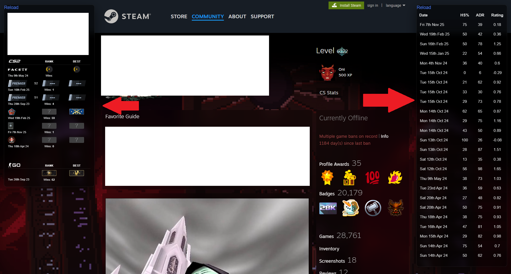

# Steam CSStats Overlay

Embed CSStats player info and recent match stats into Steam profile pages.

### 🚀 Installation
1. Install [Tampermonkey](https://www.tampermonkey.net/).
2. [**Click to Install Script**](https://github.com/LWZsama/steam-csstats-overlay/raw/refs/heads/main/steam-csstats-overlay.user.js).

### 📸 Screenshot

### 📄 License
MIT
